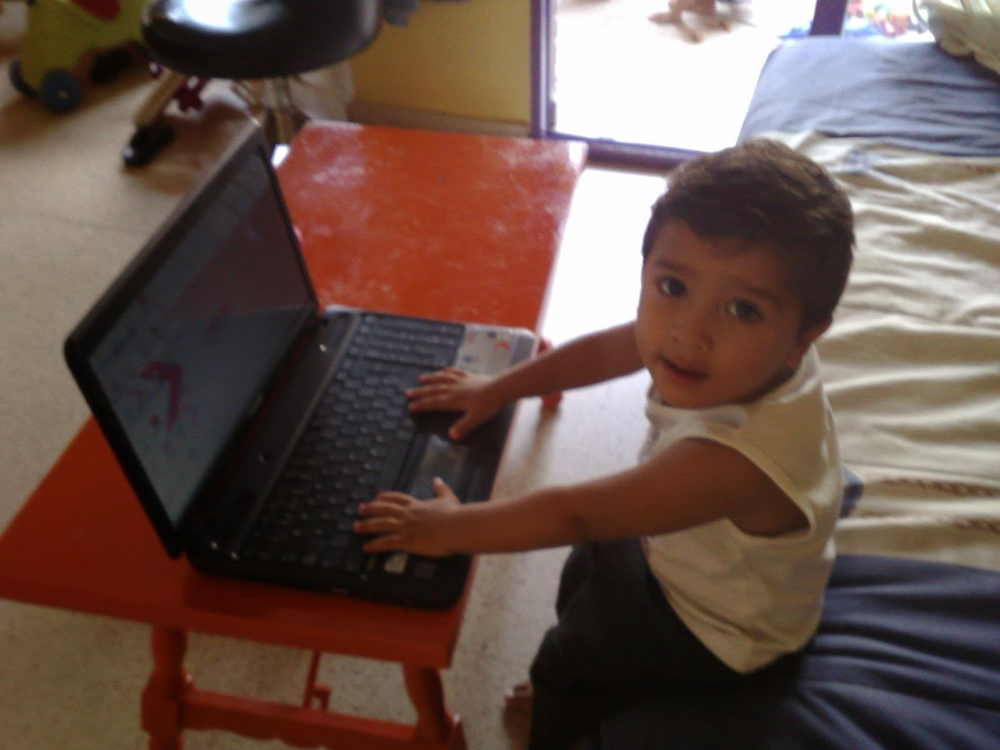

# Zain Mohammad

  

[zainmohammad.com](https://portfolio-1lak.onrender.com/)

Second-year Computer Science student @ Newcastle University with a focus on **Full-Stack** and **AI Development** projects. 

Been working on AI and ML projects, [Codebase AI](https://github.com/ZainX38/Codebase-AI), and like to contribute to open source projects on my free time such as [Ollama](https://github.com/ollama/ollama).

---

## Projects

- [Codebase AI](https://github.com/ZainX38/Codebase-AI) - query any repository in GitHub and returns a cited answer with **RAG** implemented from scratch
- [notLovable](https://github.com/ZainX38/notLovable) - made a replica of notLovable to learn more about AI development
- [Neural Network](https://github.com/ZainX38/Neural-Network) - created a Neural Network from scratch using only raw Python and numpy
- Prayer times device - a Raspberry Pi Zero 2W that calculates prayer times for Newcastle and plays the Adhan through a Bluetooth speaker
---

## Open Source
- [Ollama](https://github.com/ollama/ollama)

## Tools I use

| | |
| --- | --- |
| **Languages** | Python, JavaScript, TypeScript, Java |
| **Backend** | FastAPI, MongoDB, PostgreSQL Supabase |
| **Frontend** | React, Next.js, Tailwind CSS |
| **AI** | Ollama, embeddings, OpenClaw, OpenAI API |
| **Other** | Docker, Linux, Raspberry Pi, Git |

---

**Get in Contact:** 
[zainchema2007@gmail.com](zainchema2007@gmail.com) | [zainmohammad.com](https://portfolio-1lak.onrender.com/)
